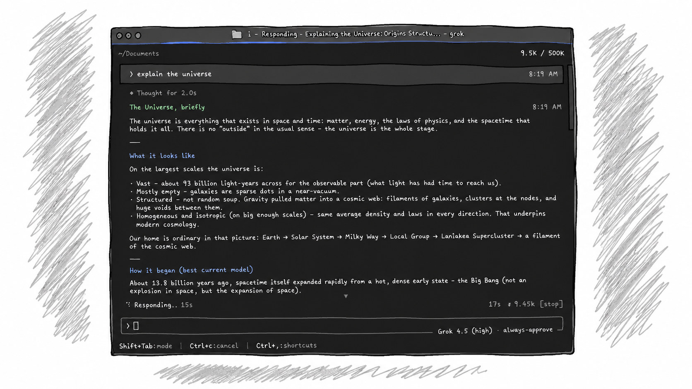
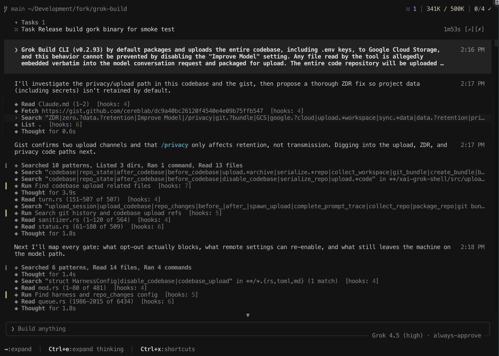

<div align="center">

<h1>
  <picture>
    <source media="(prefers-color-scheme: dark)" srcset="docs/assets/gork-build-symbol-white.png">
    <source media="(prefers-color-scheme: light)" srcset="docs/assets/gork-build-symbol-black.png">
    
  </picture>
  <br>
  Gork Build (<code>gork</code>)
</h1>

**Gork Build: the VSCodium-style community build of Grok Build — [research / product analytics hard-off](https://gist.github.com/cereblab/dc9a40bc26120f4540e4e09b75ffb547)**

An independent, community-maintained distribution of
[SpaceXAI Grok Build](https://github.com/xai-org/grok-build) with vendor
telemetry hard-off and a community rebrand (compatibility identifiers such as
`~/.grok`, `GROK_*`, and API hosts are retained).

**Privacy note:** agent-selected model context (prompts, tool results, file
contents the agent reads) still goes to the model API — that is how cloud
coding works. Research uploads and product analytics are hard-off separately;
they are not the same channel.

[Building from source](#build-from-source) ·
[Privacy](#privacy-guarantees-client) ·
[Documentation](#documentation) ·
[Contributing](#contributing) ·
[License](#license)



**Gork Build is to [Grok Build](https://github.com/xai-org/grok-build) what
[VSCodium](https://github.com/VSCodium/vscodium) is to VS Code.**

This repository contains the Rust source for the `gork` CLI/TUI and agent
runtime, forked from [`xai-org/grok-build`](https://github.com/xai-org/grok-build)
with research telemetry hard-off and a community rebrand (paths, env prefixes,
and API hosts kept for compatibility).

</div>

---

Comparison at a glance:

| | Grok Build (upstream) | **Gork Build** (this fork) |
|--|----------------------|---------------------------|
| License | Apache-2.0 | Apache-2.0 (same code) |
| Agent / tools / TUI | Full | Full |
| Model inference | Yes (Grok API) | Yes (your credentials) |
| Mixpanel / product events | On by default in releases | **Hard-off** |
| GCS research / session traces | Upload pipeline present | **Hard-off** |
| Whole-repo research packaging | Present upstream | **Disabled** |
| Vendor auto-update | Yes (`x.ai/cli`) | **Hard-disabled** (rebuild / community releases) |
| Coding-data retention | Opt-in available | **Opt-out only (locked)** |

---

## Why this exists

Independent [wire analysis of Grok Build 0.2.93](https://gist.github.com/cereblab/dc9a40bc26120f4540e4e09b75ffb547)
showed that research upload paths (session traces, and historically whole-repo
snapshots) could leave the machine even when “Improve the model” was off —
including secrets in files the agent read. Upstream open-sourced the harness;
**Gork Build** re-ships that code with **privacy by construction**:

- No product analytics (Mixpanel / `events` telemetry)
- No client-side research / trace / session-state uploads to GCS
- Remote feature flags **cannot** re-enable those paths
- Coding-data retention is **opt-out only** (no opt-in path)
- Vendor auto-update is **hard-disabled**: Gork Build never installs from
  x.ai update channels (`x.ai/cli/install.*`); that path would replace this
  fork with official Grok Build. Update by rebuilding from source or installing
  community releases from **this** project.

**What still leaves the machine:** whatever the agent must send to the Grok
**model API** to work (prompts + tool results for files it actually reads).
That is required for a cloud coding agent and is separate from the research /
product-analytics hard-offs. Gork Build does not add extra research packaging
on top.

## Build from source

Requirements: Rust (see `rust-toolchain.toml`), `protoc` (see `bin/protoc`).

```sh
cargo run -p xai-grok-pager-bin              # build + launch TUI (binary: gork)
cargo build -p xai-grok-pager-bin --release  # target/release/gork
cargo check -p xai-grok-pager-bin
```

Install the release binary somewhere on your `PATH` as `gork` (and optionally
`grok` if you want the upstream command name).

On first launch, authenticate with your Grok / xAI account the same way
upstream does — model access still goes through the Grok API.

## Privacy guarantees (client)

| Channel | Gork Build behavior |
|---------|-------------------|
| `POST …/v1/responses` (model) | Used for inference only |
| `POST …/v1/storage` research traces | **Never enabled** (`resolve_trace_upload` → false) |
| Mixpanel / product events | **No-op / never constructed** |
| Sentry | Only if you set `SENTRY_DSN` yourself |
| Vendor auto-update (`x.ai/cli/install.*`) | **Hard-disabled** — rebuild from source / community releases |
| `is_data_collection_disabled` | Always **true** in this build |

See [`PRIVACY.md`](PRIVACY.md) for details and residual risks.

## Configuration tips

```toml
# ~/.grok/config.toml — all of these are already the Gork Build defaults
[features]
telemetry = false

[telemetry]
trace_upload = false
mixpanel_enabled = false
```

`[cli] auto_update` cannot re-enable vendor channels: this build never installs
from x.ai (enforced at the install chokepoint). Rebuild from source or use
community releases.

## Documentation

User guide (upstream docs tree, still accurate for features):

[`crates/codegen/xai-grok-pager/docs/user-guide/`](crates/codegen/xai-grok-pager/docs/user-guide/)

## Contributing

External contributions are welcome. See [`CONTRIBUTING.md`](CONTRIBUTING.md)
for setup, commit style, and PR expectations. Security reports: [`SECURITY.md`](SECURITY.md).

## Made with Grok 4.5

<div align="center">



</div>

## Relationship to upstream

This repository is a fork of [`xai-org/grok-build`](https://github.com/xai-org/grok-build).
We intend to pull upstream fixes periodically while keeping the privacy
hard-offs.

**Credit:** original Grok Build is developed and published by SpaceXAI under
Apache-2.0. Gork Build is an independent community distribution and is **not**
affiliated with, endorsed by, or sponsored by SpaceXAI or xAI. Grok, Grok Build,
xAI, and SpaceXAI are trademarks of their respective owners.

## License

Apache License 2.0 — see [`LICENSE`](LICENSE) and attribution in [`NOTICE`](NOTICE).

Upstream copyright (SpaceXAI) is retained as required by Apache-2.0. Community
modifications are copyright the Gork Build contributors.

## Security

Please do **not** open public issues for security reports that include secrets.
See [`SECURITY.md`](SECURITY.md).